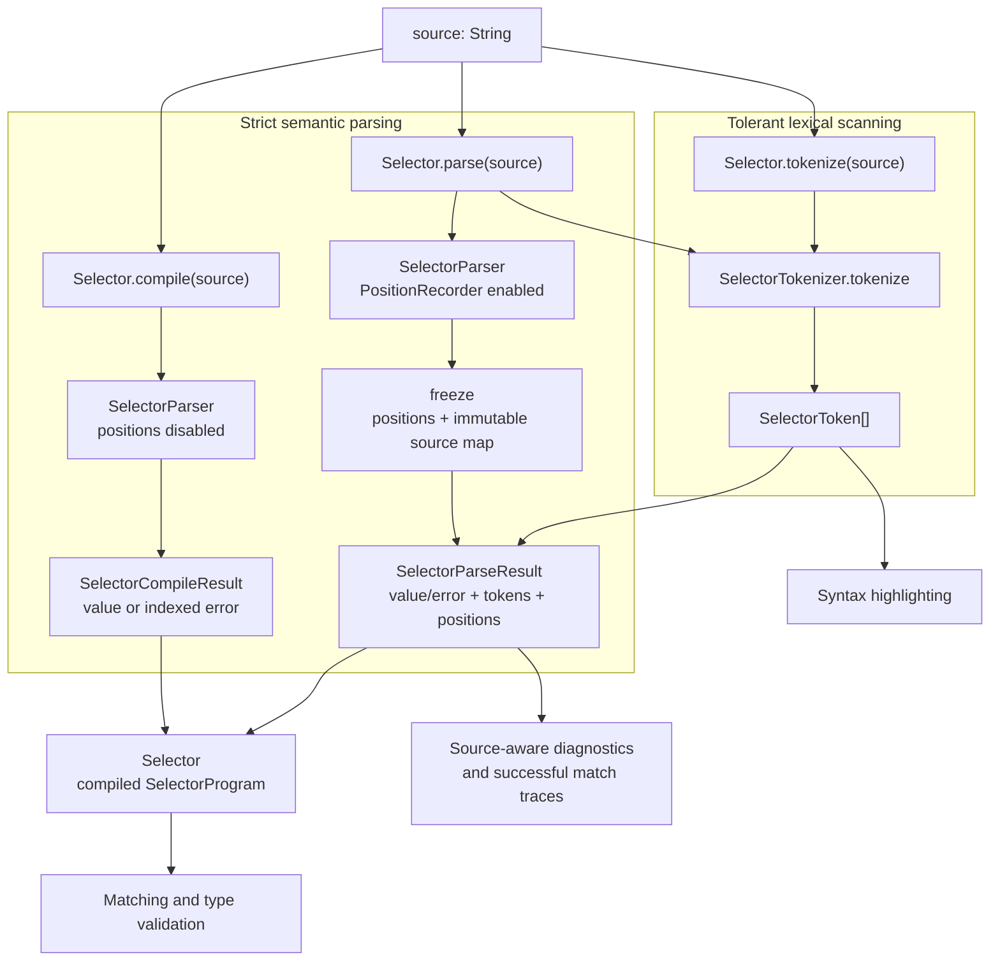

# @gkd-kit/selector

GKD selector parser, matcher, and syntax tokenizer.

The package requires a runtime with WebAssembly GC support. `regex-wasm` is initialized when the package is imported, so this requirement also applies to consumers that only call `Selector.tokenize`. Use Node.js 22 or newer, or a current browser with WebAssembly GC enabled.

## Workspace development

Node.js projects in this repository can depend on `@gkd-kit/selector` through `workspace:*` without installing Java, Gradle, or Kotlin. Fetch the already-built `dist` directory for the exact version declared in `gkd-selector/package.json`:

```shell
pnpm fetch-selector-dist
```

The command downloads the published npm package into a temporary directory, validates its name, version, JavaScript entry point, and type declaration, then replaces only the local ignored `dist` directory. It does not run automatically during dependency installation and does not modify Kotlin sources.

When changing selector Kotlin code, run the regular build instead; it replaces `dist` with output from the local sources:

```shell
pnpm --dir gkd-selector build
```

`fetch-selector-dist` requires the version in `gkd-selector/package.json` to have already been published. It never falls back to another version.

## Release

Publishing uses npm Trusted Publishing from `.github/workflows/Publish-Selector.yml`; no long-lived npm token is stored in GitHub. Configure the `@gkd-kit/selector` package on npm once with this GitHub trusted publisher:

- Organization or user: `gkd-kit`
- Repository: `gkd`
- Workflow filename: `Publish-Selector.yml`
- Allowed action: `npm publish`

For each release, update `gkd-selector/package.json` to the intended stable version, commit and push it, then create a tag with the exact package name and version:

```shell
git tag -a '@gkd-kit/selector@0.6.0' -m '@gkd-kit/selector@0.6.0'
git push origin '@gkd-kit/selector@0.6.0'
```

The workflow accepts only numeric `x.y.z` versions and verifies that the tag equals `name@version` from `package.json`. Publishing runs the package `prepack` hook, so JVM and JS tests, the production build, TypeScript checking, and Node.js tests must all pass before npm receives the package.

## Source maps

The npm package rewrites source-map paths for project files to the published `src/commonMain` and `src/jsMain` directories. Kotlin/JS also emits mappings to compiler-owned logical sources, including Kotlin standard-library files and sources synthesized for `js(...)` blocks. These paths may point under `../build/...` even though no corresponding `.kt` file is generated or published. This is expected: project sources remain available for debugging, while unavailable compiler sources fall back to the generated JavaScript.

## API architecture



`compile` does not scan highlight tokens, and `tokenize` does not build a matching program. `parse` combines both paths for callers that need matching, highlighting, and exact source positions together.

The internal packages follow runtime responsibility rather than file shape:

- `syntax` owns parsing, tokenization, source positions, and printing.
- `property` owns property/value expressions, evaluation, type checking, built-ins, and regular expressions.
- `relation` owns tree relationship expressions and traversal.
- `engine` owns selector expressions, compilation, and matching execution.

The root package contains the public API and the small contracts shared by these implementations.

## Parse and match

```ts
import { Selector, JsNodeAdapter } from '@gkd-kit/selector';

const result = Selector.compile("Button[text='OK']");
const selector = result.value;

class ExampleNodeAdapter extends JsNodeAdapter<Node> {
  // Implement the node-tree adapter methods. getNodeKey must return a stable,
  // non-null equality key even if getParent/getChild create fresh wrappers.
}
```

Use `Selector.parse(source)` when source positions and highlight tokens are also required. Both compile and parse results expose `value`; reading `value` from a failure throws its indexed `SelectorSyntaxException`. Invalid regular expressions also expose the underlying JVM or `regex-wasm` diagnostic through `error.detail`, and their range covers the complete string literal.

## Query snapshot contract

Each matching operation observes one stable node-tree snapshot. During a call to `Selector.match`, `Selector.matchWithTrace`, or any query helper on Kotlin `NodeAdapter` / JavaScript `JsNodeAdapter`, adapter methods must return deterministic names, attributes, invocation results, relationships, and traversal order for the same arguments. State changes, including refreshed accessibility nodes, must become visible only to the next matching operation.

The node type must be non-null on Kotlin and JavaScript. `null` is reserved for an absent parent or child and for matching or query failure.

`NodeAdapter.getNodeKey` on Kotlin and `JsNodeAdapter.getNodeKey` on JavaScript are part of this contract: equal keys must identify the same logical node, distinct logical nodes must have unequal keys, and their equality and hash codes must remain stable for the operation. The matcher uses these keys to memoize path-independent failed search states during backtracking.

JavaScript node keys must be non-null. `JsNodeAdapter` rejects `null` or `undefined` keys when they enter matching or traversal instead of treating different nodes as the same logical node.

## Fast query overrides

Enabling fast queries explicitly accepts an implementation-specific query order. The result order, including the first matching node, may differ from a regular depth-first query; disable fast queries when depth-first order is required.

`NodeAdapter.getFastQueryDescendants` on Kotlin and `JsNodeAdapter.getFastQueryDescendants` on JavaScript are correctness-sensitive optimization hooks. An override must return every descendant matching at least one supplied fast query and return each logical node at most once according to `getNodeKey`, but it does not need to preserve the order of `getDescendants`. Selector matching validates every candidate again, so an override may return false positives but must not omit candidates. Kotlin implementations return a `Sequence`; JavaScript implementations return an `Iterable` and can use a synchronous generator method. Both implementations should yield candidates incrementally so first-result helpers can stop before later fast queries run. A one-shot JavaScript iterable must be recreated on each hook call, and its generator must not own resources that require explicit closing.

## Type validation

Use `selector.validateType(typeModel)` when selectors need to be checked against a host type model. `createDefaultSelectorTypeModel()` provides the built-in GKD model. JavaScript callers can construct a custom immutable model with `JsSelectorTypeModelBuilder`; its `property` and `method` functions accept `JsSelectorType` values created by that same builder.

`selector.validateType(typeModel)` is the fast validation path: it stops at the first error and returns `SelectorTypeResult`, so expected failures do not require `catch`. A failure contains one structured `SelectorTypeException`; reading its `value` throws that same exception instance.

Editors and debugging tools can call `selector.getTypeErrors(typeModel)` to collect every independent type error, ordered by source position. A selector created by `Selector.parse` retains source positions, so its errors include exact ranges; a selector created by `Selector.compile` performs the same checks with `null` ranges. Syntax failure produces no selector and therefore cannot proceed to type checking.

Type failures from selectors created by `Selector.parse` include an exact source range. Matching-only selectors created by `Selector.compile` do not retain positions, so their type failure range is `null`.

## Successful match trace

Use Kotlin `NodeAdapter.matchWithTrace` or JavaScript `JsNodeAdapter.matchWithTrace` (and their `querySelectorWithTrace` / `querySelectorAllWithTrace` helpers) when a UI needs to explain a successful match. The result contains only the successful logical branch and a flat list of relation steps recorded during that search; it does not replay traversal or retain failed search branches.

Selectors returned by `Selector.parse` attach source ranges to trace units and steps. Selectors returned by `Selector.compile` remain matching-only, so trace ranges are `null`.

## Syntax highlighting only

```ts
import { Selector } from '@gkd-kit/selector';

const tokens = Selector.tokenize("Button[text='OK']");
```

Each token exposes `kind.name` and `scope.name` as stable strings for `data-*` attributes. `kind` describes the lexical category, while `scope` distinguishes selector, property, and relation syntax without requiring semantic parsing.

For exact context-sensitive highlighting, use the tokens and semantic `positions` returned by `Selector.parse`. Semantic position boundaries align with token boundaries, so a highlighter can safely combine token kinds with every containing position kind.
